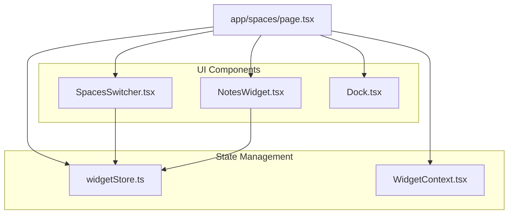
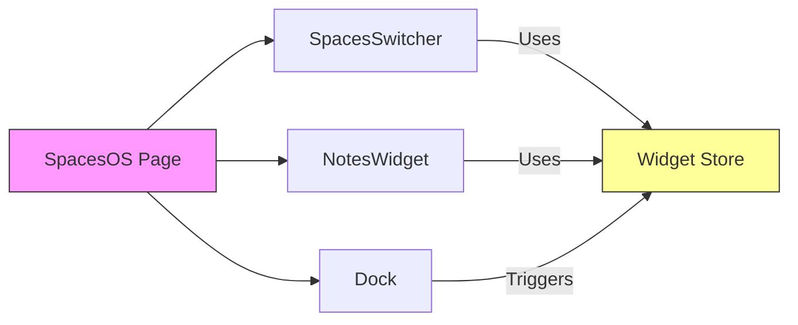

# Super App AI Development Context

## Latest Status (Last Updated: [current_date])
- Authentication: ✓ Google OAuth implemented with protected routes
- Current modules: Home, Social, Collaborative OS, Authentication ✓
- All configurations working: Next.js, Tailwind, Netlify
- All configurations working: Next.js, Tailwind, Netlify, NextAuth

## Documentation Structure
- AI_CONTEXT.md (this file) - Main development context
- LATEST_CHANGES.md - Detailed changelog and technical updates
- PROJECT_SETUP.md - Project structure and setup guide
- MILESTONE.md - Major achievement tracking
- RESTART.md - Development restart protocols

## Recent Major Achievement (From MILESTONE.md)
Successfully implemented first phase of Collaborative OS module:
- Multiple virtual spaces with distinct backgrounds
- Draggable sticky notes widget system
- Space switching with smooth transitions
- Persistent widget state across sessions
- Modern dock interface

## Latest Changes (From LATEST_CHANGES.md)
Recent updates:
- Implemented multi-space system with dynamic backgrounds
- Created draggable notes widget framework
- Added space switcher with smooth animations
- Set up persistent widget store using Zustand
- Integrated modern dock interface

## Project References
- GitHub: https://github.com/terryyaki/Project_Mark_I
- Netlify: https://inquisitive-bonbon-08be2e.netlify.app/
- Branch: main
- Project Root: /Users/terrynguyen/Projects/Project_Mark_I

## Project Vision
- Core Concept: Modular super-platform that can spawn independent apps
- Platform Type: Web-first, later mobile/desktop apps
- Key Feature: Modules can become standalone applications

### Module Details
1. Home Hub
   - Module launcher/dashboard
   - User customization
   - Cross-module notifications
   - Responsive design (mobile/desktop)

2. Social Space
   - Inspiration: RedBook/TikTok style
   - Rich media sharing
   - User interactions
   - Content discovery

3. Collaborative OS (In Progress)
   Features:
   - Virtual Desktop ✓
     * Customizable backgrounds ✓
     * Multiple spaces/rooms ✓
     * Moveable windows/widgets ✓
   - Next Features Planned:
     * Shared music (like Spotify)
     * Watch parties
     * Group chat/messaging
     * Work timer
     * Habit tracker
     * Journal widget

## Current Development Phase
- Status: Active Development - Collaborative OS Module
- Completed Features:
  * Space management system
  * Notes widget with drag-and-drop
  * Space-specific content persistence
  * Smooth transitions between spaces
- Next Features:
  * Additional widget types
  * Social features integration
  * Real-time collaboration

## Development Standards
1. File Structure:
   - All new modules go in src/modules/
   - Each module needs: components/, api/, types/
   - Use Tailwind CSS for styling
   - TypeScript for all new code

2. Key Files:
   - PROJECT_SETUP.md (core structure)
   - LATEST_CHANGES.md (recent updates)
   - RESTART.md (restart guide)

## Version Control Practices

### 1. Experimental Features
Always create a new branch:
```bash
git checkout -b experiment/feature-name
git push -u origin experiment/feature-name
```
### 2. Safety Checkpoints
Before risky changes:
```bash
git stash save "Description of current work"
or
git checkout -b backup/current-state
```
### 3. Recovery Options
- Undo last commit: `git reset --soft HEAD~1`
- Go back to checkpoint: `git checkout <commit-hash>`
- Recover stashed work: `git stash apply`
- Delete failed experiment: `git branch -D experiment/feature-name`

### 4. AI Guidance Protocol
When starting risky changes, AI should:
1. Recommend creating a new branch
2. Save current state
3. Create recovery checkpoints
4. Document each major change

## Common AI Prompts
1. Continue Development:
   "Review AI_CONTEXT.md and PROJECT_SETUP.md. I'm working on [module/feature]. Last update was [description]."

2. New Feature:
   "Check AI_CONTEXT.md for project structure. I want to add [feature] to [module]. Maintain existing patterns."

3. Update Documentation:
   "Update AI_CONTEXT.md and PROJECT_SETUP.md with these changes: [list changes]"

## Active TODOs
- [x] Add user authentication
- [ ] Implement social post functionality
- [ ] Set up database
- [ ] Add user profiles and preferences

## Restart Protocol
1. Start Cursor and open project:
```bash
cursor
cd /Users/terrynguyen/Projects/Project_Mark_I
```

2. Update and check status:
```bash
git pull origin main
./update-project-log.sh
```

3. Use this prompt:
"I'm continuing work on Project_Mark_I. Please review:

1. Check Latest Context:
- AI_CONTEXT.md (project status & vision)
- LATEST_CHANGES.md (recent updates)
- Version Control Practices

2. Project Details:
- GitHub: https://github.com/terryyaki/Project_Mark_I
- Netlify: https://inquisitive-bonbon-08be2e.netlify.app/
- Branch: main

3. Current Focus:
[Describe what you're working on]

4. Last Session:
[Add your last major change]

Please help continue development following our established patterns and safety protocols."

## Documentation Updates
When updating project status:
1. Update AI_CONTEXT.md with high-level changes
2. Add technical details to LATEST_CHANGES.md
3. Record major achievements in MILESTONE.md
4. Update PROJECT_SETUP.md with new structures
5. Ensure RESTART.md reflects current workflow

## Recent Updates
- [current_date]: Created MILESTONE.md for tracking achievements
- [current_date]: Updated LATEST_CHANGES.md with technical details
- [current_date]: Implemented Collaborative OS initial version
- [current_date]: Added space switching system
- [current_date]: Created draggable notes widget
- [current_date]: Set up widget persistence
- 2024-11-05 09:36: Cloned from super_app template
- 2024-11-05 09:36: Set up new GitHub repository
- 2024-11-05 09:36: Deployed to Netlify
- 2024-11-05 09:36: Updated project documentation
- 2024-11-04 22:28:45: Set up Netlify deployment successfully
- 2024-11-04 22:28:45: Updated project documentation
- 2024-11-04 22:28:45: Added Collaborative OS module plan
- 2024-11-04 22:28:45: Created RESTART.md with work protocols

## Project Structure
Current working directory structure:
```
Project_Mark_I/
├── src/
│   ├── app/
│   │   ├── page.tsx              # Home page
│   │   ├── social/              # Social module
│   │   └── spaces/              # Collaborative OS
│   │       └── page.tsx         # Spaces main page
│   ├── components/
│   │   ├── dock/                # Dock interface
│   │   │   └── Dock.tsx
│   │   ├── navigation/          # Navigation components
│   │   │   └── NavBar.tsx
│   │   ├── spaces/             # Space management
│   │   │   └── SpacesSwitcher.tsx
│   │   └── widgets/            # Widget components
│   │       └── NotesWidget.tsx
│   ├── store/                  # State management
│   │   └── widgetStore.ts
│   └── contexts/               # React contexts
│       └── WidgetContext.tsx
├── public/                     # Static assets
├── Documentation/
│   ├── AI_CONTEXT.md          # Main development context
│   ├── LATEST_CHANGES.md      # Detailed changelog
│   ├── PROJECT_SETUP.md       # Setup guide
│   ├── MILESTONE.md           # Achievement tracking
│   └── RESTART.md             # Restart protocols
├── package.json
├── tsconfig.json
├── next.config.js
└── tailwind.config.js
```

## File Structure Updates
When adding new components or modules:
1. Update this structure in AI_CONTEXT.md
2. Document purpose of new directories
3. Note key file relationships
4. Update PROJECT_SETUP.md accordingly

## File Relationships


## Component Dependencies


## File Structure Update Protocol

### 1. Adding New Components
When adding a new component:
```bash
# 1. Create component directory if needed
mkdir -p src/components/[category]

# 2. Create component file
touch src/components/[category]/ComponentName.tsx

# 3. Update AI_CONTEXT.md structure
# 4. Document relationships
```

### 2. Adding New Features
When adding a feature that spans multiple files:
1. Document the feature's file structure:
```
Feature Name/
├── components/
│   └── FeatureComponent.tsx
├── store/
│   └── featureStore.ts
└── types/
    └── feature.types.ts
```

2. Update relationship diagrams
3. Add to project structure
4. Document dependencies

### 3. Structure Update Checklist
- [ ] Add new files to project structure
- [ ] Update component relationships
- [ ] Document new dependencies
- [ ] Update mermaid diagrams
- [ ] Add purpose comments
- [ ] Update PROJECT_SETUP.md

### 4. Version Control Integration
```bash
# After updating structure
git add AI_CONTEXT.md
git add PROJECT_SETUP.md
git commit -m "docs: Update project structure with [feature]

- Add new component relationships
- Update file structure
- Document dependencies"
```

## Documentation Sync Protocol

### 1. Style Guide Updates
When changing diagram styles or conventions:
1. Update the style guide section in AI_CONTEXT.md
2. Update all existing diagrams to match
3. Document the change reason and date
4. Update any related documentation

Example update entry:
```markdown
## Style Guide Change Log
- [date]: Changed store representation from [/Store/] to [[Store]]
  * Reason: Better visibility in dark mode
  * Updated all diagrams to reflect change
  * Files affected: AI_CONTEXT.md, PROJECT_SETUP.md
```

### 2. Deviation Tracking
When deviating from established patterns:
```markdown
## Style Exceptions
- Component: NotesWidget
  * Standard: Pink fill for UI components
  * Exception: Using purple fill (#e5d8ff)
  * Reason: Distinguish draggable widgets
  * Date: [current_date]
```

### 3. Documentation Update Checklist
When making changes:
- [ ] Update style guide section
- [ ] Document exceptions
- [ ] Update existing diagrams
- [ ] Add change log entry
- [ ] Update related files
- [ ] Commit changes with clear message

### 4. Version Control
```bash
# When updating style guide
git commit -m "docs(style): Update diagram conventions

- Change: [description]
- Reason: [explanation]
- Updated files: [list]
- Exception added: [if any]"
```

## Documentation Organization

### 1. Module Documentation
```
docs/
├── modules/
│   ├── spaces/
│   │   ├── SPACES.md           # Module overview
│   │   ├── WIDGETS.md         # Widget documentation
│   │   ├── STYLES.md          # Module-specific styles
│   │   ├── STATE.md           # State management
│   │   └── INTERACTIONS.md    # User interactions
│   ├── social/
│   │   ├── SOCIAL.md          # Social module docs
│   │   ├── FEED.md            # Feed system
│   │   └── INTERACTIONS.md    # Social interactions
│   └── home/
│       ├── HOME.md            # Home module docs
│       └── NAVIGATION.md      # Navigation system
├── styles/
│   ├── STYLE_GUIDE.md         # Global style guide
│   ├── COMPONENTS.md          # Component styles
│   ├── ANIMATIONS.md          # Animation patterns
│   └── THEMES.md              # Theme system
├── technical/
│   ├── ARCHITECTURE.md        # System architecture
│   ├── PATTERNS.md            # Code patterns
│   ├── STATE.md               # State management
│   └── PERFORMANCE.md         # Performance guidelines
└── development/
    ├── WORKFLOW.md            # Development workflow
    ├── CONVENTIONS.md         # Coding conventions
    ├── TESTING.md            # Testing guidelines
    └── DEPLOYMENT.md         # Deployment process
```

### 2. AI Documentation Protocol
When in a long conversation, AI should:
1. Request relevant documentation:
```markdown
Would you like me to check:
- docs/modules/spaces/WIDGETS.md for widget details?
- docs/styles/ANIMATIONS.md for animation patterns?
- docs/technical/STATE.md for state management?
```

2. Remind about documentation context:
```markdown
Note: This conversation is getting long. Should we:
1. Review relevant documentation files?
2. Update documentation with new changes?
3. Create new documentation for recent features?
```

3. Track documentation updates:
```markdown
Recent documentation changes:
- Updated WIDGETS.md with new note features
- Added animation patterns to STYLES.md
- Created new STATE.md for widget store
```

### 3. Documentation Update Protocol

#### When Adding New Features:
1. Create Documentation:
```bash
# Create relevant .md files
touch docs/modules/[module]/[feature].md
```

2. Update AI_CONTEXT.md:
```markdown
## Documentation Updates
- Added [feature].md for [description]
  * Location: docs/modules/[module]/
  * Purpose: [explanation]
  * Related files: [list]
```

3. Cross-reference in existing docs:
```markdown
## Related Documentation
- [New Feature].md - [brief description]
```

#### When Updating Features:
1. Update relevant .md files
2. Add changelog entry
3. Update AI_CONTEXT.md references

#### Documentation Checklist:
- [ ] Create/update feature documentation
- [ ] Update AI_CONTEXT.md
- [ ] Cross-reference in related docs
- [ ] Add changelog entry
- [ ] Commit documentation changes

### 4. Version Control Integration
```bash
# After documentation updates
git add docs/
git add AI_CONTEXT.md
git commit -m "docs: Update documentation for [feature]

- Added: [new files]
- Updated: [changed files]
- Related: [references]"
```

### 5. AI Documentation Reminders
The AI should prompt for documentation in these situations:
1. When new features are added:
```markdown
Note: Should we create documentation for:
- [feature].md for the new functionality?
- Update ARCHITECTURE.md with new patterns?
- Add to relevant module documentation?
```

2. When making significant changes:
```markdown
Remember to update:
- Feature-specific documentation
- AI_CONTEXT.md references
- Related documentation files
```

3. During long conversations:
```markdown
This conversation has covered multiple features. Should we:
1. Review current documentation?
2. Update affected files?
3. Create new documentation for:
   - [Feature A]
   - [Feature B]
```

### 6. Documentation Style Guide
[... existing style guide content ...]

## Active Documentation Files
Current documentation coverage:
1. Spaces Module
   - SPACES.md ✓
   - WIDGETS.md ✓
   - INTERACTIONS.md ✓
2. Home Module
   - HOME.md ✓
   - NAVIGATION.md ✓
3. Technical
   - STATE.md ✓
4. Styles
   - ANIMATIONS.md ✓

## Documentation Awareness Protocol
AI will:
1. Track documentation in AI_CONTEXT.md
2. Request relevant files during discussions
3. Remind about updates when features change
4. Suggest new documentation when needed

## Recent Major Achievement
Successfully implemented authentication system:
- Google OAuth integration
- Protected routes
- Type-safe sessions
- Auth-aware layouts

## Current Working Code Structure
### Core Files
```typescript:src/app/profile/page.tsx
// Actual working code here
```
```typescript:src/components/dock/Dock.tsx
// Actual working code here
```

### Package Dependencies
- next-auth@latest: Auth system, Google OAuth
- lucide-react@latest: Icons for Dock, SpacesSwitcher
- zustand@latest: State management for widgets
- framer-motion: Animations for dock and widgets

### Known Working Solutions
1. Auth Issues:
   - JWT Session Error → Use "next-auth/next" import
   - Google OAuth Loop → Check callback URLs in .env

2. Component Issues:
   - Lucide Icons → Check import from 'lucide-react'
   - Widget Context → Use useWidget() not useWidgets()

## Development Guidelines
### Common Mistakes to Avoid
1. File Creation
   - Check existing pages before creating new ones
   - Reference Project Structure section
   - Verify against Component Dependencies diagram

2. Package Management
   - Check Package Dependencies section first
   - Verify import paths before reinstalling
   - Reference Known Working Solutions

## Critical References
- CURRENT_CODE_STATE.md: Contains working code, packages, and known good imports
- Refer to this before suggesting new files or packages
- Check against this when debugging import or package issues

## AI Problem-Solution Protocol

### 1. When Solving Problems
AI should immediately:
1. Document the solution in CURRENT_CODE_STATE.md
2. Ask user to verify:
```markdown
Should we update documentation for this solution?
- Add to Known Working Solutions ✓
- Update Package Dependencies ✓
- Check for redundant files ✓
- Verify folder structure is current ✓
```

### 2. After Installing Packages
AI should prompt:
```markdown
New package installed. Let's update:
1. CURRENT_CODE_STATE.md:
   - Add [package@version] to dependencies
   - Document what it's used for
2. Check for conflicts with existing packages
3. Add any common import patterns
4. Document any known issues/solutions
```

### 3. When Creating New Files
AI should verify:
```markdown
Before creating [new_file], let's check:
1. Does similar file exist? (Check Project Structure)
2. Is this following our file organization?
3. Should we update:
   - Project Structure diagram
   - Component Dependencies
   - File Relationships
```

### 4. Regular Check-ins
During long conversations, AI should periodically ask:
```markdown
Should we pause to update documentation?
1. New solutions documented? ✓
2. Package list current? ✓
3. File structure accurate? ✓
4. All problems/solutions logged? ✓
```

## Project Analysis Tools

### 1. Structure Scanner
```bash
npm run scan-project
# Updates AI_CONTEXT.md with current project structure
```

### 2. Dependency Analyzer
```bash
npm run analyze-deps
# Updates component relationship diagrams
```

### 3. Context Updater
```bash
npm run update-context
# Keeps AI_CONTEXT.md synchronized
```

### 4. Type Generator
```bash
npm run check-types
# Validates and generates missing types
```

### Usage in AI Conversations
The AI should:
1. Run structure scan before solving problems
2. Check dependencies when discussing imports
3. Validate types when working with TypeScript
4. Keep context updated during long conversations

## AI Pre-Solution Protocol

### 1. Problem Assessment
```bash
# Run diagnostic scripts first
npm run scan-project    # Get current structure
npm run analyze-deps    # Check dependencies
npm run check-types     # Validate types

# Check Cursor problems window
- Note all error messages
- Group by file/type
- Check error patterns
```

### 2. Context Verification
Before solving, verify:
```markdown
1. Current Project State
   - [ ] Scanned file structure
   - [ ] Checked Cursor problems
   - [ ] Verified package.json
   - [ ] Checked tsconfig.json

2. Related Files
   - [ ] Listed affected files
   - [ ] Checked import/export chain
   - [ ] Verified file locations
   - [ ] Noted dependent components

3. Documentation Status
   - [ ] Checked CURRENT_CODE_STATE.md
   - [ ] Reviewed recent changes
   - [ ] Listed needed updates
```

### 3. Solution Planning
Before implementing:
```markdown
1. Changes Required
   - [ ] Files to modify
   - [ ] New files needed
   - [ ] Package changes
   - [ ] Type updates

2. Documentation Updates
   - [ ] AI_CONTEXT.md
   - [ ] CURRENT_CODE_STATE.md
   - [ ] Project structure
   - [ ] Known solutions

3. Verification Steps
   - [ ] Test cases needed
   - [ ] Type checking
   - [ ] Import verification
   - [ ] Structure validation
```

### 4. Post-Solution Checklist
After implementing:
```markdown
1. Update Documentation
   - [ ] Record solution
   - [ ] Update file structure
   - [ ] Add known solutions
   - [ ] Update dependencies

2. Verify Changes
   - [ ] Run all checks
   - [ ] Test imports
   - [ ] Validate types
   - [ ] Check new files

3. Future Prevention
   - [ ] Document patterns
   - [ ] Update scripts
   - [ ] Add test cases
```

## File Creation Protocol

### Auto-Generated File Headers
Every file includes:
```typescript
/**
 * @file ${filePath}
 * @context This file is part of the Super App project
 * @docs See AI_CONTEXT.md for full project context
 * @created ${new Date().toISOString()}
 * @module ${getModuleFromPath(filePath)}
 * @dependencies [auto-generated list of imports]
 * @related [auto-generated list of related files]
 */`;
```

### File Registration System
- All files are tracked in `.file-registry.json`
- AI_CONTEXT.md auto-updates on file creation
- Dependency graphs stay current
- Documentation reminders generated

### Documentation Links
Every new file should reference:
1. Its module's documentation
2. Related component docs
3. This context file
4. Any relevant ADRs

### Usage Example
```typescript:src/components/new-component.tsx
/**
 * @file src/components/new-component.tsx
 * @context See AI_CONTEXT.md
 * @module Spaces
 * @dependencies SpaceContext, WidgetSystem
 * @related SpacesList.tsx, SpacesContent.tsx
 */
```

## Project Automation System

### Overview
The project includes an automated system for:
- Tracking file changes
- Monitoring problems
- Generating documentation
- Maintaining project health

### Key Components
1. **Core Automation**
```typescript
// scripts/automation/core.ts
- ProjectAutomation class
- State management
- File watching
- Problem monitoring
```

2. **Problem Checking**
```typescript
// scripts/automation/problem-checker.ts
- Integrates with Cursor
- Tracks TypeScript errors
- Monitors import issues
```

3. **Documentation Generation**
```typescript
// scripts/automation/docs/generator.ts
- Auto-updates AI_CONTEXT.md
- Tracks project state
- Maintains documentation
```

### Usage
```bash
# Start automation with development
npm run dev  # Includes automation

# Run automation separately
npm run automation
```

### File Structure
```
scripts/
├── automation/
│   ├── core.ts
│   ├── problem-checker.ts
│   ├── health-checker.ts
│   ├── docs/
│   │   └── generator.ts
│   └── utils/
│       └── logger.ts
└── setup-automation.ts
```

