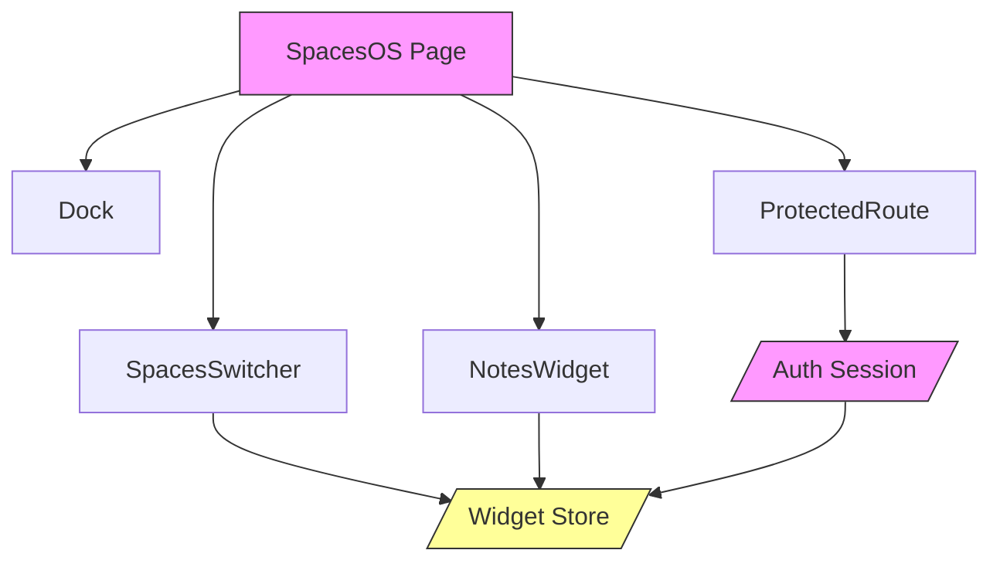

# Spaces Module

## Overview
Virtual workspace system with multiple customizable spaces and widgets.

## Current Features
- Multiple virtual spaces with distinct backgrounds
- Space switching with smooth transitions
- Widget support (currently Notes)
- Dock interface for widget management
- Protected routes with authentication
- User-specific spaces

## Components Structure

## Latest Updates
- Added authentication protection
- Prepared for user-specific spaces
- Integrated session management

## Related Documentation
- WIDGETS.md - Widget system details
- STATE.md - State management
- INTERACTIONS.md - User interaction patterns 