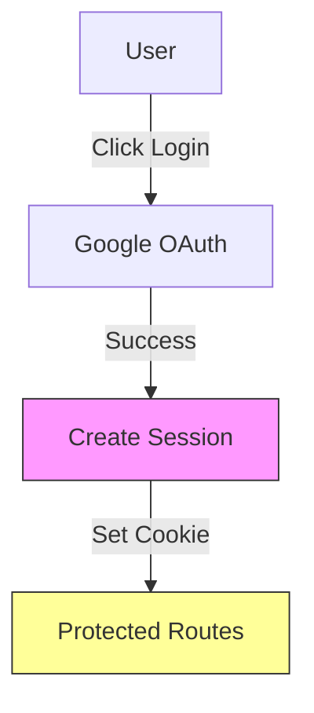

# Authentication System

## Latest Implementation

### Type System
```typescript
// Types for user preferences and session
interface UserPreferences {
  theme: 'light' | 'dark' | 'system';
  defaultSpace: string;
  widgetPreferences: {
    noteColor: string;
    fontSize: number;
  };
}

// Extended NextAuth types
declare module 'next-auth' {
  interface Session {
    user: {
      id: string;
      preferences: UserPreferences;
    } & DefaultSession['user']
  }
}
```

### File Structure
```
src/
├── lib/
│   └── auth.ts              # Auth configuration and types
├── types/
│   └── next-auth.d.ts       # Type declarations for NextAuth
```

## Auth Flow


## Package Installation
```bash
# Install Next-Auth
npm install next-auth
```

## Implementation Steps

1. Create auth configuration:
```typescript:src/app/api/auth/[...nextauth]/route.ts
import NextAuth from 'next-auth';
import GoogleProvider from 'next-auth/providers/google';

export const authOptions = {
  providers: [
    GoogleProvider({
      clientId: process.env.GOOGLE_CLIENT_ID!,
      clientSecret: process.env.GOOGLE_CLIENT_SECRET!,
    }),
  ],
};

const handler = NextAuth(authOptions);
export { handler as GET, handler as POST };
```

2. Create environment file:
```env:.env.local
GOOGLE_CLIENT_ID=your_client_id
GOOGLE_CLIENT_SECRET=your_client_secret
NEXTAUTH_URL=http://localhost:3000
NEXTAUTH_SECRET=your_generated_secret
```

3. Add auth provider to layout:
```typescript:src/app/providers.tsx
'use client';

import { SessionProvider } from 'next-auth/react';

export function Providers({ children }: { children: React.ReactNode }) {
  return <SessionProvider>{children}</SessionProvider>;
}
```

4. Update root layout:
```typescript:src/app/layout.tsx
import { Providers } from './providers';

export default function RootLayout({
  children,
}: {
  children: React.ReactNode;
}) {
  return (
    <html lang="en">
      <body>
        <Providers>{children}</Providers>
      </body>
    </html>
  );
}
```

## Configuration Steps

### 1. Google Cloud Console Setup
1. Go to [Google Cloud Console](https://console.cloud.google.com)
2. Create new project or select existing
3. Enable Google OAuth API
4. Configure OAuth consent screen
5. Create OAuth 2.0 credentials
6. Add authorized redirect URIs:
   - `http://localhost:3000/api/auth/callback/google` (development)
   - `https://inquisitive-bonbon-08be2e.netlify.app/api/auth/callback/google` (production)

### 2. Environment Variables
Development (.env.local):
```env
GOOGLE_CLIENT_ID=your_client_id
GOOGLE_CLIENT_SECRET=your_client_secret
NEXTAUTH_URL=http://localhost:3000
NEXTAUTH_SECRET=your_generated_secret
```

Production (Netlify):
```env
GOOGLE_CLIENT_ID=your_client_id
GOOGLE_CLIENT_SECRET=your_client_secret
NEXTAUTH_URL=https://your-netlify-url.netlify.app
NEXTAUTH_SECRET=your_production_secret
```

## Deployment Steps
1. Add environment variables to Netlify
2. Update build settings
3. Deploy and verify OAuth callback

## Latest Updates
- Added Google authentication setup
- Created login button component
- Added session management
- Updated deployment configuration

## Active Documentation Files
Current documentation coverage:
1. Spaces Module
   - SPACES.md ✓
   - WIDGETS.md ✓
   - INTERACTIONS.md ✓
2. Home Module
   - HOME.md ✓
   - NAVIGATION.md ✓
3. Technical
   - STATE.md ✓
   - AUTH.md ✓ (Updated [current_date]: Added Google OAuth setup)
4. Styles
   - ANIMATIONS.md ✓

## File Structure
```
src/
├── app/
│   └── api/
│       └── auth/
│           └── [...nextauth]/
│               ��── route.ts    # Auth route handler
+ ├── lib/
+ │   └── auth.ts              # Auth configuration and types
```

## Implementation Details
The auth system is now split into:
1. Route handler (`route.ts`) - Handles auth endpoints
2. Configuration (`auth.ts`) - Contains auth setup and types