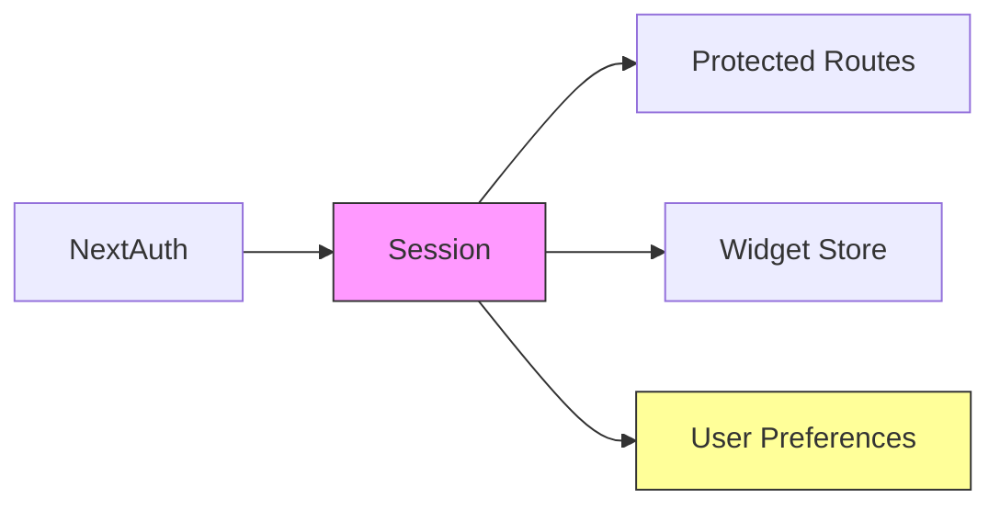
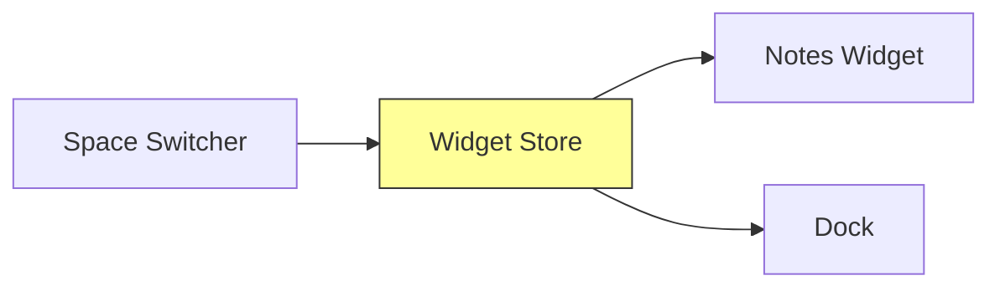

# State Management

## Authentication State
Managed by NextAuth.js session system



## Session Management
```typescript
interface ExtendedSession {
  user?: {
    id?: string;
    preferences?: {
      theme: string;
      defaultSpace: string;
    }
  } & DefaultSession['user']
}
```

## Latest Updates
+ - Added authentication state management
+ - Prepared for user preferences
+ - Integrated session with widget store



## Widget Store
Central store for managing widget state using Zustand.

### Current Implementation
```typescript
interface WidgetStore {
  notes: Note[];
  addNote: (spaceId: string) => void;
  deleteNote: (id: string) => void;
  updateNotePosition: (id: string, position: { x: number; y: number }) => void;
  updateNoteColor: (id: string, color: string) => void;
}
```

### State Flow

