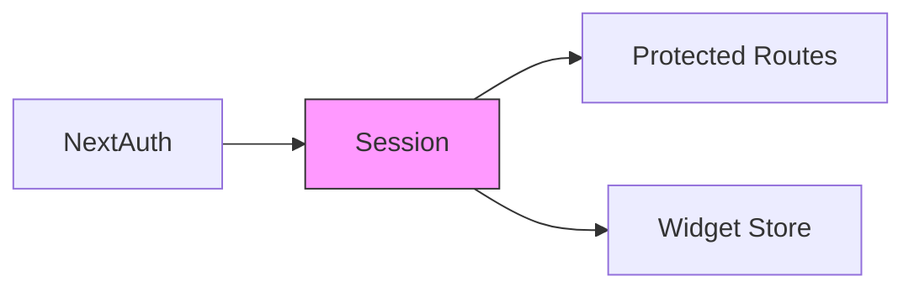
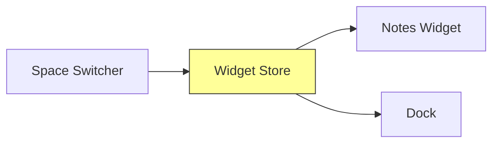

# State Management

## Authentication State
Managed by NextAuth.js session system



## Widget Store
Central store for managing widget state using Zustand.

### Current Implementation
```typescript
interface WidgetStore {
  notes: Note[];
  addNote: (spaceId: string) => void;
  deleteNote: (id: string) => void;
  updateNotePosition: (id: string, position: { x: number; y: number }) => void;
  updateNoteColor: (id: string, color: string) => void;
}
```

### State Flow


## Latest Updates
- Added space-specific filtering
- Implemented position persistence
- Added color management 